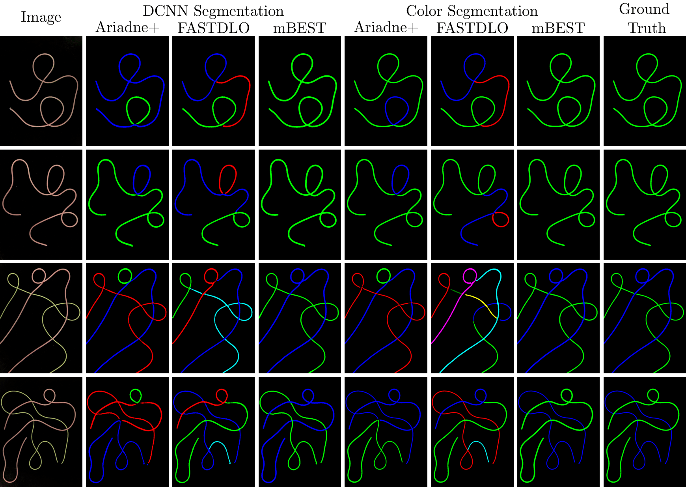

## mBEST: minimal Bending Energy Skeleton pixel Traversals

---

mBEST is a robust, realtime perception algorithm for deformable linear object (DLO) detection. The algorithm takes as input a binary mask of the DLOs from an image and produces the ordered pixel sequences for each unique DLO. The algorithm is also able to optionally produce segmentation masks. 

For the dataset provided in this repo, simple color filtering is used to achieve the binary masks.
For those interested in using mBEST for more complex scenes, please use the DCNN model provided by [FASTDLO](https://github.com/lar-unibo/fastdlo) to obtain the initial binary mask.

<p align="center">

<br>
<em> Fig. 1 mBEST Pipeline Overview </em>
</p>

---

### Instructions

All code has been developed and tested on Python 3.6 and Python 3.8. Please install the following dependencies.
```
numpy
numba
opencv-python
matplotlib
scikit-image
scikit-learn
Cython
```

Afterwards, compile functions using the shell script as shown below.
```bash
./install.sh
```

Once all installation steps have been finished, run mBEST through the provided python script as shown below.
The simple background with complex DLO configurations dataset used in the manuscript is provided in the `dataset` directory along with ground truth.
```bash
python3 run.py dataset/images/img1.jpg
```

---

Below are some results comparing mBEST with FASTDLO and Ariadne+. 

<p align="center">

<br>
<em> Fig. 2 mBEST and SOTA comparison </em>
</p>
