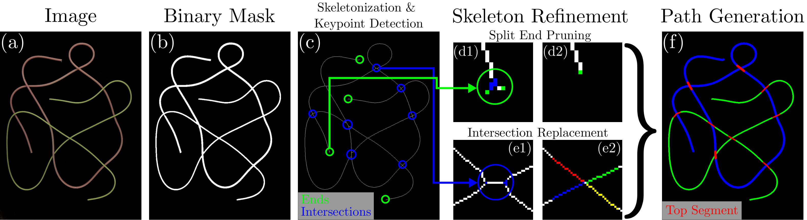

## mBEST: minimal Bending Energy Skeleton pixel Traversals

---
<p align="center">

<br>
<em> mBEST Pipeline Overview </em>
</p>


*mBEST* is a robust, realtime perception algorithm for deformable linear object (DLO) detection. The algorithm takes as input a binary mask of the DLOs from an image and produces the ordered pixel sequences as well as segmentation masks for each unique DLO.

For the dataset provided in this repo, simple color filtering is used to achieve the binary masks.
For those interested in using *mBEST* for more complex scenes, please use the DCNN model provided by [*FASTDLO*](https://github.com/lar-unibo/fastdlo) to obtain the initial binary mask.

Below is a video example showcasing the realtime capabilities of *mBEST* against the SOTA method [*RT-DLO*](https://github.com/lar-unibo/RT-DLO). 
Additional video examples showcasing more complicated cases involving numerous DLOs can be seen [here](https://www.youtube.com/watch?v=q84I9i0DOK4).

<p align="center">

<br>
<em> mBEST Realtime Video Example </em>
</p>

---

### Instructions

All code has been developed and tested on Python 3.6 and Python 3.8. Please install the following dependencies.
```
numpy
numba
opencv-python
matplotlib
scikit-image
scikit-learn
Cython
```

Afterwards, compile functions using the shell script as shown below.
```bash
./install.sh
```

Once all installation steps have been finished, run *mBEST* through the provided python script as shown below.
The simple background with complex DLO configurations dataset used in the manuscript is provided in the `dataset` directory along with ground truth labels in the form of numpy arrays.
```bash
python3 run.py dataset/S3/images/img0.jpg
```

---

Below are some results comparing *mBEST* with *Ariadne+*, *FASTDLO*, and *RT-DLO*.

<p align="center">


<br>
<em> Fig. 2 mBEST and SOTA comparison </em>
</p>

***

### Citation
If our work has helped your research, please cite the following manuscript.
```
@ARTICLE{choi2023mbest,
  author={Choi, Andrew and Tong, Dezhong and Park, Brian and Terzopoulos, Demetri and Joo, Jungseock and Jawed, Mohammad Khalid},
  journal={IEEE Robotics and Automation Letters}, 
  title={mBEST: Realtime Deformable Linear Object Detection Through Minimal Bending Energy Skeleton Pixel Traversals}, 
  year={2023},
  volume={8},
  number={8},
  pages={4863-4870},
  doi={10.1109/LRA.2023.3290419}
}
```